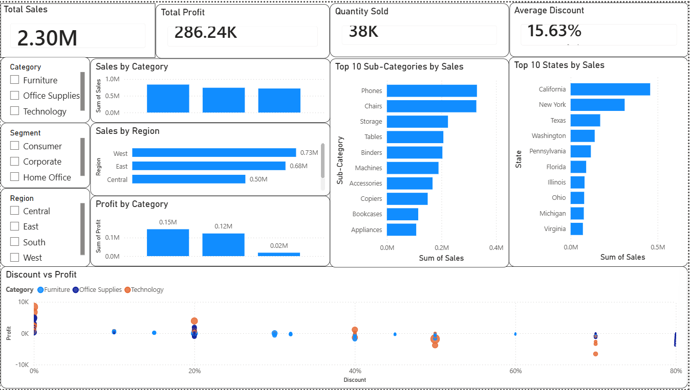

# Sales Data Analysis Project

## Overview
This project analyzes the Superstore Sales dataset using Python and Power BI to identify business insights and visualize key performance metrics.

## Tools & Technologies
- Python
- Pandas
- Matplotlib
- Power BI
- GitHub

## Dataset
Sample Superstore Dataset

## Project Workflow
1. Data Cleaning
2. Data Exploration
3. Exploratory Data Analysis (EDA)
4. Data Visualization using Python
5. Interactive Dashboard in Power BI

## Key Insights
- Total Sales and Total Profit
- Sales by Category
- Profit by Category
- Sales by Region
- Top 10 States by Sales
- Top 10 Sub-Categories by Sales
- Discount vs Profit Analysis

## Files
- `sales_analysis.py` — Python analysis script
- `SampleSuperstore.csv` — Original dataset
- `Cleaned_Superstore.csv` — Cleaned dataset
- `Sales_Analysis_Dashboard.pbix` — Power BI dashboard
- `dashboard_screenshot.png` — Dashboard preview

## Dashboard Preview

## Author

**Madeeha Fatima**
